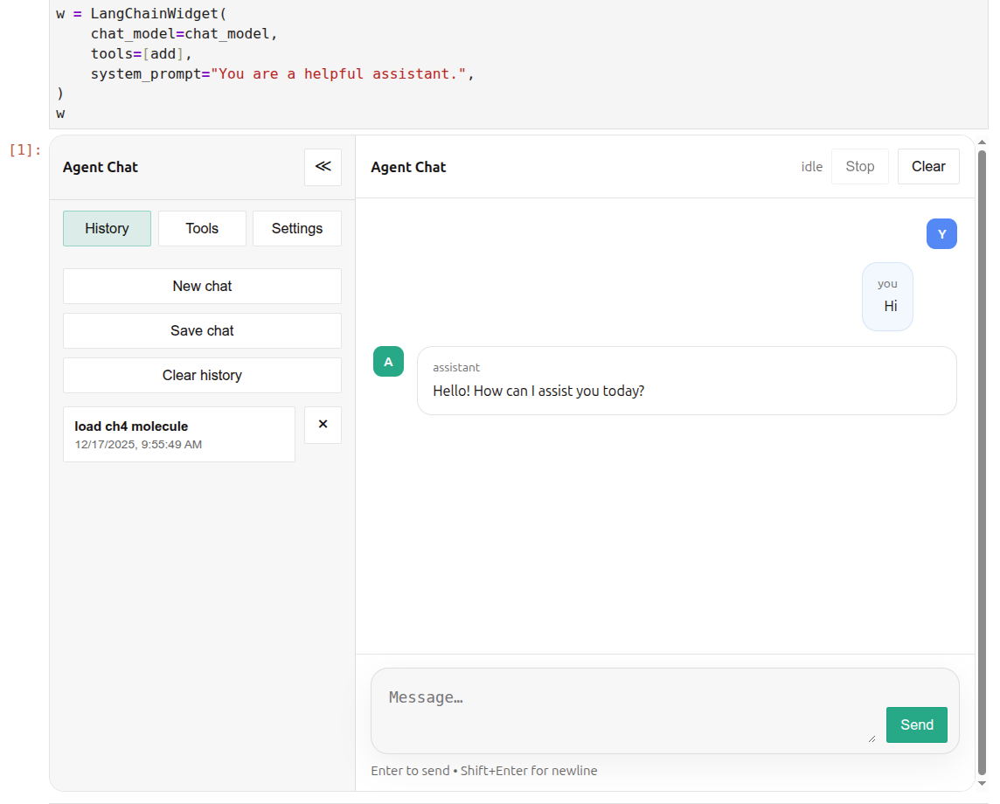

# LangChain Widget
[](https://badge.fury.io/py/langchain-widget)
[](https://github.com/superstar54/langchain-widget/actions/workflows/ci.yml)
[](https://codecov.io/gh/superstar54/langchain-widget)
[](http://langchain-widget.readthedocs.io/)

Run a `LangChain` agent in Jupyter notebooks.

An `anywidget` + React chat UI for LangChain tool-calling chat models, built for notebooks and designed to compose with other Jupyter widgets.


- Works in JupyterLab / Notebook (and VS Code notebooks)
- Tool calling out of the box (your tools, your model)
- Easy to embed alongside plots, tables, and domain widgets

## Installation

```sh
pip install langchain-widget
```

Extras for popular providers:

```sh
pip install "langchain-widget[openai]"
pip install "langchain-widget[anthropic]"
```

## Quick start

In a notebook, create a `LangChainWidget` with your chat model and tools (you can use any LangChain chat model and pass your own tools):

```python
from langchain_widget import LangChainWidget
from langchain_openai import ChatOpenAI
from langchain_core.tools import tool

chat_model = ChatOpenAI(model="gpt-4o-mini")

@tool
def add(a: int, b: int) -> int:
    "Add two integers."
    return a + b

w = LangChainWidget(
    chat_model=chat_model,
    tools=[add],
    system_prompt="You are a helpful scientific assistant.",
)
w
```

You can pass any LangChain tools (or your own `BaseTool` implementations) to support your use case.

Here is how it looks in a Jupyter notebook:



## Widget settings

`LangChainWidget` accepts the following initialization settings:

- `chat_model`: Required. A LangChain chat model that supports tool calling (for example, `ChatOpenAI`).
- `tools`: Optional. An iterable of `BaseTool` instances or an object with a `.tools` attribute.
- `system_prompt`: Optional. A system prompt string to steer the agent.
- `max_steps`: Optional. Maximum number of tool-calling steps per user message.
- `title`: Optional. Title shown in the chat UI.
- `history_path`: Optional. Filesystem path for storing chat history. When omitted, history stays in memory only.
- `sidebar_open`: Optional. Whether the left sidebar menu is open on initial render.


## Documentation

Full documentation at: https://langchain-widget.readthedocs.io/


## Development

See `langchain-widget/docs/source/development.rst`.

## Contact

* Xing Wang  <xingwang1991@gmail.com>

## License

[MIT](http://opensource.org/licenses/MIT)
